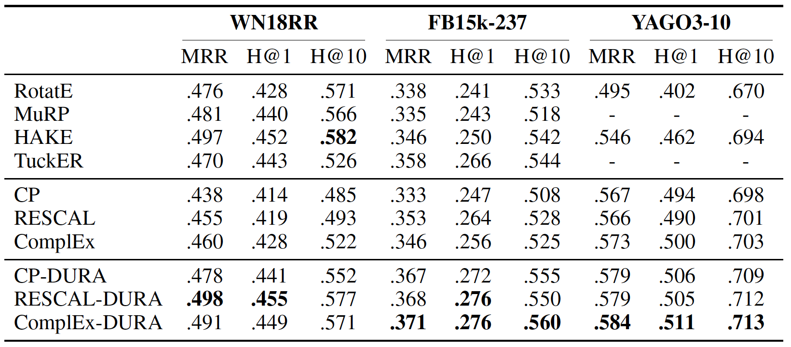

# DURA: Duality-Induced Regularizer for Tensor Factorization Based Knowledge Graph Completion

This repository contains the code and the datasets of This is the code of paper 
**Duality-Induced Regularizer for Tensor Factorization Based Knowledge Graph Completion**. 
Zhanqiu Zhang, Jianyu Cai, Jie Wang. NeurIPS 2020. [[arXiv](https://arxiv.org/abs/2011.05816)]
[[NeurIPS-Official](https://proceedings.neurips.cc/paper/2020/hash/f6185f0ef02dcaec414a3171cd01c697-Abstract.html)]

## Dependencies
- Python 3.6+
- PyTorch 1.0+
- NumPy 1.17.2+
- tqdm 4.41.1+

## Results
The results of **DURA** on **WN18RR**, **FB15k-237** and **YAGO3-10** are as follows.



 

## Reproduce the Results

### 1. Preprocess the Datasets
To preprocess the datasets, run the following commands.

```shell script
cd code
python process_datasets.py
```

Now, the processed datasets are in the `data` directory.

### 2. Reproduce the Results 
To reproduce the results of CP, ComplEx and RESCAL with
the DURA regularizer on WN18RR, FB15k237 and YAGO3-10,
please run the following commands.

```shell script
#################################### WN18RR ####################################
# CP
CUDA_VISIBLE_DEVICES=0 python learn.py --dataset WN18RR --model CP --rank 2000 --optimizer Adagrad \
--learning_rate 1e-1 --batch_size 100 --regularizer DURA --reg 1e-1 --max_epochs 200 \
--valid 5 -train -id 0 -save -weight

# ComplEx
CUDA_VISIBLE_DEVICES=0 python learn.py --dataset WN18RR --model ComplEx --rank 2000 --optimizer Adagrad \
--learning_rate 1e-1 --batch_size 100 --regularizer DURA_W --reg 1e-1 --max_epochs 50 \
--valid 5 -train -id 0 -save -weight

# RESCAL
CUDA_VISIBLE_DEVICES=2 python learn.py --dataset WN18RR --model RESCAL --rank 256 --optimizer Adagrad \
--learning_rate 1e-1 --batch_size 1024 --regularizer DURA_RESCAL --reg 1e-1 --max_epochs 200 \
--valid 5 -train -id 0 -save -weight

#################################### FB237 ####################################
# CP
CUDA_VISIBLE_DEVICES=0 python learn.py --dataset FB237 --model CP --rank 2000 --optimizer Adagrad \
--learning_rate 1e-1 --batch_size 100 --regularizer DURA_W --reg 5e-2 --max_epochs 200 \
--valid 5 -train -id 0 -save

# ComplEx
CUDA_VISIBLE_DEVICES=0 python learn.py --dataset FB237 --model ComplEx --rank 2000 --optimizer Adagrad \
--learning_rate 1e-1 --batch_size 100 --regularizer DURA_W --reg 5e-2 --max_epochs 200 \
--valid 5 -train -id 0 -save

# RESCAL
CUDA_VISIBLE_DEVICES=0 python learn.py --dataset FB237 --model RESCAL --rank 512 --optimizer Adagrad \
--learning_rate 1e-1 --batch_size 512 --regularizer DURA_RESCAL --reg 5e-2 --max_epochs 200 \
--valid 5 -train -id 0 -save


#################################### YAGO3-10 ####################################
# CP
CUDA_VISIBLE_DEVICES=0 python learn.py --dataset YAGO3-10 --model CP --rank 1000 --optimizer Adagrad \
--learning_rate 1e-1 --batch_size 1000 --regularizer DURA_W --reg 5e-3 --max_epochs 200 \
--valid 5 -train -id 0 -save -weight

# ComplEx
CUDA_VISIBLE_DEVICES=0 python learn.py --dataset YAGO3-10 --model ComplEx --rank 1000 --optimizer Adagrad \
--learning_rate 1e-1 --batch_size 1000 --regularizer DURA_W --reg 5e-3 --max_epochs 200 \
--valid 5 -train -id 0 -save

# RESCAL
CUDA_VISIBLE_DEVICES=0 python learn.py --dataset YAGO3-10 --model RESCAL --rank 512 --optimizer Adagrad \
--learning_rate 1e-1 --batch_size 1024 --regularizer DURA_RESCAL_W --reg 5e-3 --max_epochs 200 \
--valid 5 -train -id 0 -save -weight
```

## Citation
If you find this code useful, please consider citing the following paper.
```
@inproceedings{zhang2020duality,
  title={Duality-Induced Regularizer for Tensor Factorization Based Knowledge Graph Completion},
  author={Zhang, Zhanqiu and Cai, Jianyu and Wang, Jie},
  booktitle={Advances in Neural Information Processing Systems},
  year={2020}
}
```

## Acknowledgement
We refer to the code of [kbc](https://github.com/facebookresearch/kbc). Thanks for their contributions.

## Other Repositories
If you are interested in our work, you may find the following paper useful.

**Learning Hierarchy-Aware Knowledge Graph Embeddings for Link Prediction.**
*Zhanqiu Zhang, Jianyu Cai, Yongdong Zhang, Jie Wang.* AAAI 2020. [[paper](https://arxiv.org/pdf/1911.09419.pdf)] [[code](https://github.com/MIRALab-USTC/KGE-HAKE)]
